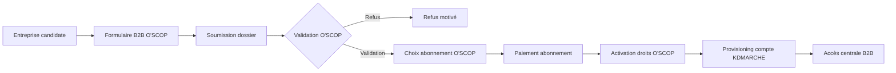
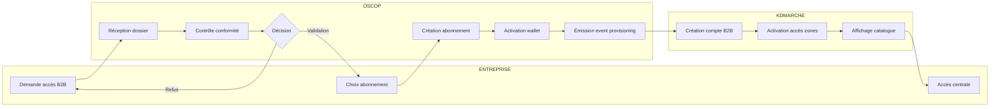
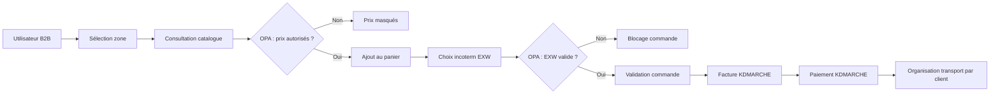
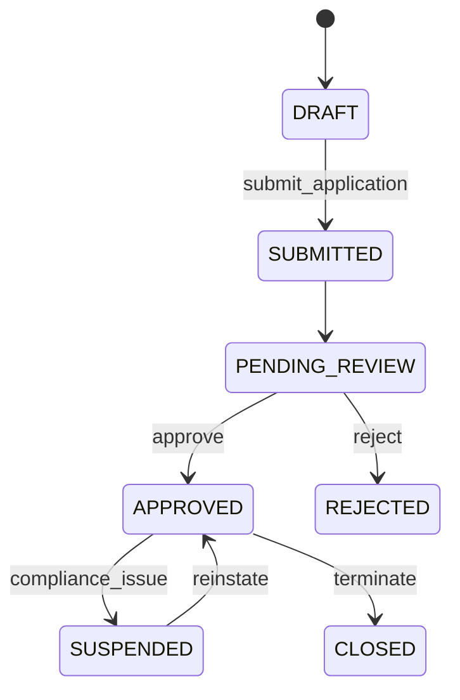
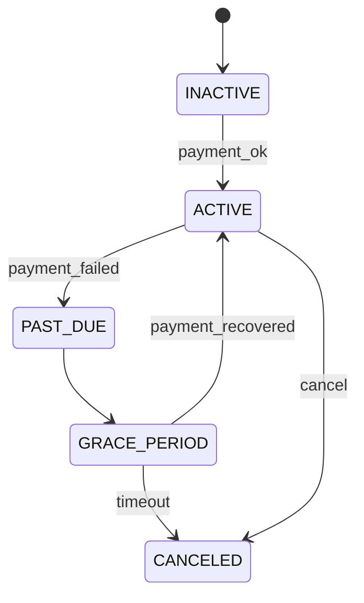
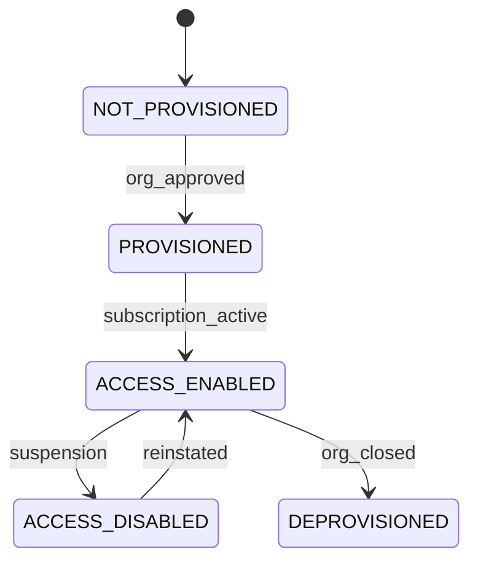
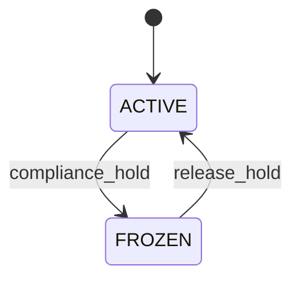
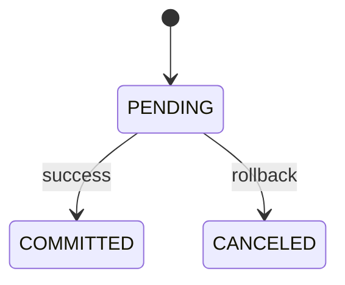
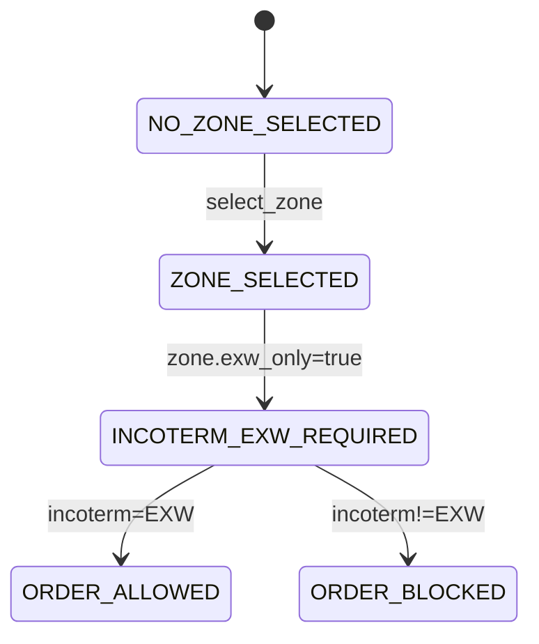

# KDMARCHE × O'SCOP - Diagrammes BPMN & Statecharts

> Documentation technique des processus métier et machines d'états
> Format: Mermaid (compatible GitHub, GitLab, Notion, MkDocs)

---

## 1. BPMN — ONBOARDING B2B KDMARCHE – O'SCOP

### 1.1 Vue Macro (Processus Principal)



### 1.2 Swimlane (Entreprise / O'SCOP / KDMARCHE)



### 1.3 Processus Commande B2B (OPA Gating)



---

## 2. STATECHARTS — Machines d'États

### 2.1 Organisation (ORG)



**Transitions:**
| De | Vers | Événement | Action Backend |
|----|------|-----------|----------------|
| DRAFT | SUBMITTED | Soumission dossier | `POST /applications/{id}/submit` |
| PENDING_REVIEW | APPROVED | Validation compliance | `POST /applications/{id}/decision` |
| APPROVED | SUSPENDED | Problème compliance/impayé | `POST /admin/orgs/{id}/suspend` |

### 2.2 Abonnement (Subscription)



**Règles métier:**
- `PAST_DUE` après échec prélèvement
- `GRACE_PERIOD` : 7-14 jours de relance
- `CANCELED` → désactivation accès KDMARCHE

### 2.3 Partenaire KDMARCHE (Provisioning)



**Événements webhook O'SCOP → KDMARCHE:**
- `org.approved` → PROVISIONED
- `subscription.activated` → ACCESS_ENABLED
- `org.suspended` → ACCESS_DISABLED

### 2.4 Wallet (Portefeuille Crédits)



### 2.5 Ledger Entry (Écriture Comptable)



**Invariant:** Toute consommation crédits suit ce cycle atomique.

### 2.6 Commande / Zone EXW



---

## 3. Mapping Diagrammes ↔ Policy OPA

| Diagramme | Transition | Rule OPA | Endpoint |
|-----------|------------|----------|----------|
| ORG | APPROVED → SUSPENDED | `org.status` | `/admin/orgs/{id}/suspend` |
| ABONNEMENT | ACTIVE → PAST_DUE | `subscription.status` | Webhook PSP |
| PARTENAIRE | ACCESS_ENABLED | `partner_accounts.status` | Auto-sync |
| COMMANDE | ORDER_ALLOWED | `incoterm_allowed` | `/orders` |
| PRIX | SHOW / HIDE | `show_price` | `/pricing` |

> **Principe clé:** Zéro logique métier en dur dans le front ou l'API. 
> Toute décision d'accès passe par le Policy Engine (ABAC).

---

## 4. Implémentation Backend

### Collections MongoDB correspondantes

```
orgs                    → Statechart ORG
subscriptions           → Statechart ABONNEMENT
partner_accounts        → Statechart PARTENAIRE
wallets                 → Statechart WALLET
wallet_ledger           → Statechart LEDGER
org_runtime_preferences → Zone sélectionnée
```

### Fichiers source

- `schema_v2.py` : Définition des Enums et modèles
- `abac_policy.py` : Policy Engine (équivalent OPA)
- `routes_v2.py` : Endpoints API

---

*Document généré pour KDMARCHE × O'SCOP - Centrale d'achats B2B ESS*
*Version: 1.0 - Janvier 2025*
