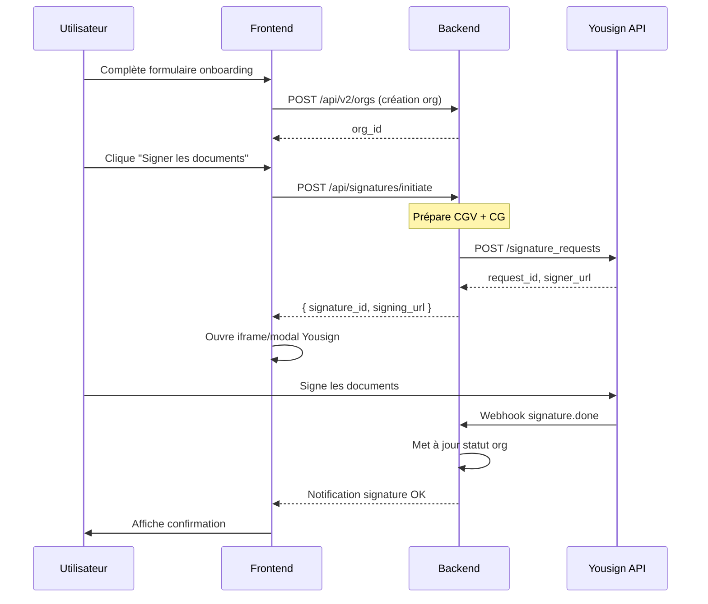
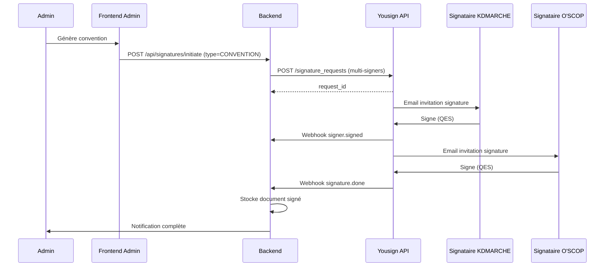
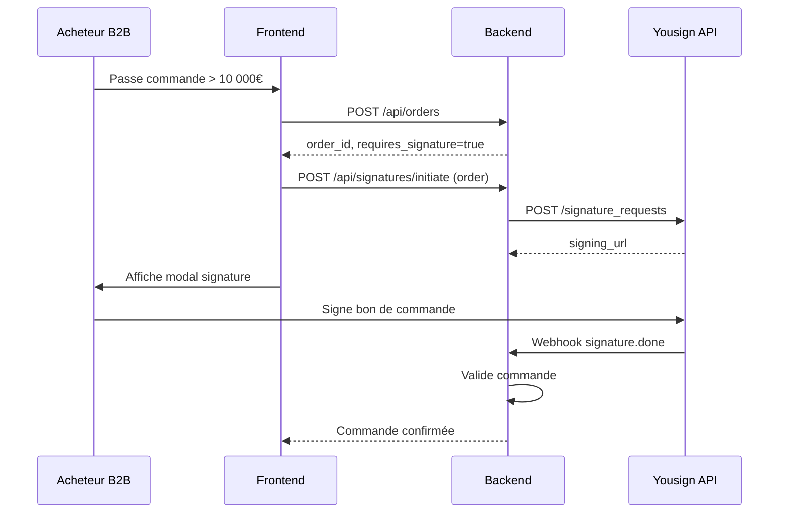

# Intégration Signature Électronique eIDAS - KDMARCHE × O'SCOP

## Table des Matières
1. [Vue d'ensemble](#vue-densemble)
2. [Niveaux de signature eIDAS](#niveaux-de-signature-eidas)
3. [Fournisseurs recommandés](#fournisseurs-recommandés)
4. [Architecture proposée](#architecture-proposée)
5. [Workflows de signature](#workflows-de-signature)
6. [Implémentation technique](#implémentation-technique)
7. [Conformité et audit](#conformité-et-audit)
8. [Prochaines étapes](#prochaines-étapes)

---

## Vue d'ensemble

### Contexte
La plateforme KDMARCHE × O'SCOP nécessite l'intégration d'un service de signature électronique conforme au règlement eIDAS (EU No 910/2014) pour :
- **Convention de partenariat** entre KDMARCHE et O'SCOP
- **Conditions Générales O'SCOP** (CG) - acceptation par les adhérents
- **Conditions Générales de Vente KDMARCHE** (CGV B2B) - acceptation par les acheteurs
- **Contrats d'adhésion** B2B avec les organisations

### Objectifs
- ✅ Conformité eIDAS pour l'Union Européenne
- ✅ Signature des documents légaux depuis l'interface utilisateur
- ✅ Audit trail complet et horodatage qualifié
- ✅ Intégration seamless dans le workflow B2B existant

---

## Niveaux de signature eIDAS

### Comparatif des niveaux

| Niveau | Description | Cas d'usage KDMARCHE/O'SCOP |
|--------|-------------|----------------------------|
| **SES** (Simple) | Signature basique (ex: case à cocher, email) | ❌ Non recommandé |
| **AES** (Advanced) | Signature liée au signataire, création sous contrôle exclusif | ✅ CGV, CG, documents standards |
| **QES** (Qualified) | Équivalent signature manuscrite, certificat qualifié QTSP | ✅ Convention partenariat, contrats haute valeur |

### Recommandation
- **AES** (Advanced Electronic Signature) pour :
  - Acceptation des CGV KDMARCHE
  - Acceptation des CG O'SCOP
  - Documents d'adhésion B2B standard

- **QES** (Qualified Electronic Signature) pour :
  - Convention de partenariat KDMARCHE × O'SCOP
  - Contrats de grande valeur (> 50 000€)
  - Documents nécessitant une force probante maximale

---

## Fournisseurs recommandés

### 1. Yousign (🇫🇷 Recommandé)
**QTSP qualifié français - Idéal pour le marché DOM-TOM**

| Critère | Évaluation |
|---------|------------|
| Conformité eIDAS | ✅ QES, AES, SES |
| API REST | ✅ V3 moderne, bien documentée |
| Langues | ✅ Français natif |
| Tarification | À partir de 9€/mois (25 signatures) |
| Support DOM-TOM | ✅ Excellent |
| QTSP français | ✅ Supervisé par l'ANSSI |

**API Sandbox** : `https://staging-api.yousign.app/v3`
**API Production** : `https://api.yousign.app/v3`

### 2. eID Easy (🇪🇺 Alternative)
**Multi-provider, 80+ méthodes d'authentification**

| Critère | Évaluation |
|---------|------------|
| Conformité eIDAS | ✅ QES, AES via multiple QTSPs |
| Couverture | ✅ 160+ pays |
| API | ✅ REST simple |
| Tarification | Pay-per-use |

### 3. DocuSign (🌍 Enterprise)
**Leader mondial, mais plus coûteux**

| Critère | Évaluation |
|---------|------------|
| Conformité eIDAS | ✅ Via partenariats QTSP |
| Intégration | ✅ SDKs multiples |
| Tarification | €€€ (enterprise) |
| Pertinence | ⚠️ Surdimensionné pour nos besoins |

### Recommandation finale
**Yousign** est le choix optimal pour KDMARCHE × O'SCOP :
- QTSP français certifié ANSSI
- Interface et support en français
- Tarification adaptée aux PME/ESS
- Excellent support DOM-TOM
- API moderne et bien documentée

---

## Architecture proposée

### Diagramme de flux

```
┌─────────────────────────────────────────────────────────────────────┐
│                        KDMARCHE × O'SCOP                            │
│                         Frontend React                               │
├─────────────────────────────────────────────────────────────────────┤
│  ┌──────────────┐    ┌──────────────┐    ┌──────────────┐          │
│  │ DocumentPage │    │ OnboardingPage│    │  WalletPage  │          │
│  │  /documents  │    │  /onboarding │    │   /wallet    │          │
│  └──────┬───────┘    └──────┬───────┘    └──────────────┘          │
│         │                    │                                       │
│         │    ┌───────────────┴───────────────┐                      │
│         │    │     SignatureModal.jsx        │                      │
│         └────┤  - Preview document           │                      │
│              │  - Initiate signature         │                      │
│              │  - Track status               │                      │
│              └───────────────┬───────────────┘                      │
└──────────────────────────────┼──────────────────────────────────────┘
                               │
                               ▼
┌─────────────────────────────────────────────────────────────────────┐
│                        Backend FastAPI                              │
├─────────────────────────────────────────────────────────────────────┤
│  ┌──────────────────────────────────────────────────────────────┐  │
│  │                   routes_signature.py                         │  │
│  ├──────────────────────────────────────────────────────────────┤  │
│  │  POST /api/signatures/initiate                               │  │
│  │  GET  /api/signatures/{id}/status                            │  │
│  │  POST /api/signatures/webhook                                │  │
│  │  GET  /api/signatures/{id}/download                          │  │
│  └──────────────────────────────────────────────────────────────┘  │
│                               │                                     │
│  ┌──────────────────────────────────────────────────────────────┐  │
│  │                   signature_service.py                        │  │
│  ├──────────────────────────────────────────────────────────────┤  │
│  │  - YousignClient (API wrapper)                               │  │
│  │  - create_signature_request()                                │  │
│  │  - upload_document()                                         │  │
│  │  - add_signer()                                              │  │
│  │  - get_status()                                              │  │
│  │  - download_signed_document()                                │  │
│  └──────────────────────────────────────────────────────────────┘  │
└──────────────────────────────┼──────────────────────────────────────┘
                               │
                               ▼
┌─────────────────────────────────────────────────────────────────────┐
│                     Yousign API (QTSP)                              │
├─────────────────────────────────────────────────────────────────────┤
│  POST /signature_requests                                           │
│  POST /signature_requests/{id}/documents                            │
│  POST /signature_requests/{id}/signers                              │
│  PATCH /signature_requests/{id}/activate                            │
│  GET  /signature_requests/{id}                                      │
│  Webhooks → signature.done, signature.declined                      │
└─────────────────────────────────────────────────────────────────────┘
```

### Collections MongoDB

```javascript
// signatures collection
{
  "id": "sig_xxxxx",
  "org_id": "org_xxxxx",
  "user_id": "user_xxxxx",
  "document_type": "CGV_KDMARCHE",  // CGV_KDMARCHE, CG_OSCOP, CONVENTION, ADHESION
  "document_version": "2026-01",
  "yousign_request_id": "sr_xxxxx",
  "status": "PENDING",  // DRAFT, PENDING, SIGNED, DECLINED, EXPIRED
  "signers": [
    {
      "email": "contact@entreprise.fr",
      "name": "Jean Dupont",
      "role": "SIGNER",
      "signed_at": null
    }
  ],
  "signed_document_url": null,
  "audit_trail": [
    { "action": "CREATED", "timestamp": "2026-01-16T10:00:00Z", "actor": "user_xxx" },
    { "action": "SENT", "timestamp": "2026-01-16T10:01:00Z", "actor": "system" }
  ],
  "created_at": "2026-01-16T10:00:00Z",
  "updated_at": "2026-01-16T10:01:00Z",
  "expires_at": "2026-01-23T10:00:00Z"
}
```

---

## Workflows de signature

### Workflow 1 : Acceptation CGV/CG lors de l'onboarding



### Workflow 2 : Signature Convention Partenariat (Admin)



### Workflow 3 : Signature commande B2B



---

## Implémentation technique

### Variables d'environnement

```env
# backend/.env
YOUSIGN_API_KEY=your_api_key_here
YOUSIGN_ENVIRONMENT=sandbox  # sandbox | production
YOUSIGN_WEBHOOK_SECRET=your_webhook_secret
```

### Structure des fichiers

```
/app/backend/
├── signature_service.py      # Client Yousign + logique métier
├── routes_signature.py       # Endpoints API
├── schema_signature.py       # Modèles Pydantic
└── webhooks/
    └── yousign_handler.py    # Traitement webhooks

/app/frontend/src/
├── components/
│   └── SignatureModal.jsx    # Modal de signature
├── pages/
│   └── DocumentsPage.jsx     # Intégration signature
└── services/
    └── api.js               # + signatureAPI
```

### Exemple de code backend

```python
# signature_service.py
import httpx
import os
from datetime import datetime, timedelta

class YousignClient:
    def __init__(self):
        self.api_key = os.environ.get("YOUSIGN_API_KEY")
        self.env = os.environ.get("YOUSIGN_ENVIRONMENT", "sandbox")
        self.base_url = (
            "https://api.yousign.app/v3" if self.env == "production"
            else "https://staging-api.yousign.app/v3"
        )
        self.headers = {
            "Authorization": f"Bearer {self.api_key}",
            "Content-Type": "application/json"
        }
    
    async def create_signature_request(
        self,
        name: str,
        delivery_mode: str = "email",
        expiration_days: int = 7
    ) -> dict:
        """Create a new signature request"""
        async with httpx.AsyncClient() as client:
            response = await client.post(
                f"{self.base_url}/signature_requests",
                headers=self.headers,
                json={
                    "name": name,
                    "delivery_mode": delivery_mode,
                    "expiration_date": (
                        datetime.utcnow() + timedelta(days=expiration_days)
                    ).isoformat() + "Z"
                }
            )
            response.raise_for_status()
            return response.json()
    
    async def upload_document(
        self,
        request_id: str,
        file_content: bytes,
        filename: str
    ) -> dict:
        """Upload a document to signature request"""
        import base64
        async with httpx.AsyncClient() as client:
            response = await client.post(
                f"{self.base_url}/signature_requests/{request_id}/documents",
                headers=self.headers,
                json={
                    "file_name": filename,
                    "file_content": base64.b64encode(file_content).decode()
                }
            )
            response.raise_for_status()
            return response.json()
    
    async def add_signer(
        self,
        request_id: str,
        email: str,
        first_name: str,
        last_name: str,
        document_id: str,
        signature_level: str = "electronic_signature"  # or qualified_electronic_signature
    ) -> dict:
        """Add a signer to the request"""
        async with httpx.AsyncClient() as client:
            response = await client.post(
                f"{self.base_url}/signature_requests/{request_id}/signers",
                headers=self.headers,
                json={
                    "info": {
                        "first_name": first_name,
                        "last_name": last_name,
                        "email": email
                    },
                    "signature_level": signature_level,
                    "signature_authentication_mode": "otp_email",
                    "fields": [
                        {
                            "document_id": document_id,
                            "type": "signature",
                            "page": 1,
                            "x": 100,
                            "y": 700,
                            "width": 200,
                            "height": 50
                        }
                    ]
                }
            )
            response.raise_for_status()
            return response.json()
    
    async def activate_request(self, request_id: str) -> dict:
        """Activate/start the signature request"""
        async with httpx.AsyncClient() as client:
            response = await client.patch(
                f"{self.base_url}/signature_requests/{request_id}/activate",
                headers=self.headers
            )
            response.raise_for_status()
            return response.json()
    
    async def get_status(self, request_id: str) -> dict:
        """Get signature request status"""
        async with httpx.AsyncClient() as client:
            response = await client.get(
                f"{self.base_url}/signature_requests/{request_id}",
                headers=self.headers
            )
            response.raise_for_status()
            return response.json()
```

### Exemple de code frontend

```jsx
// components/SignatureModal.jsx
import { useState } from 'react';
import { Dialog, DialogContent, DialogHeader, DialogTitle } from '../components/ui/dialog';
import { Button } from '../components/ui/button';
import { Loader2, FileSignature, CheckCircle2 } from 'lucide-react';

export default function SignatureModal({ 
  isOpen, 
  onClose, 
  documentType, 
  onSignatureComplete 
}) {
  const [status, setStatus] = useState('idle'); // idle, loading, signing, complete
  const [signingUrl, setSigningUrl] = useState(null);

  const initiateSignature = async () => {
    setStatus('loading');
    try {
      const response = await signatureAPI.initiate(documentType);
      setSigningUrl(response.signing_url);
      setStatus('signing');
    } catch (error) {
      toast.error('Erreur lors de l\'initialisation');
      setStatus('idle');
    }
  };

  // Handle iframe message for completion
  useEffect(() => {
    const handleMessage = (event) => {
      if (event.data.type === 'yousign_signature_done') {
        setStatus('complete');
        onSignatureComplete?.();
      }
    };
    window.addEventListener('message', handleMessage);
    return () => window.removeEventListener('message', handleMessage);
  }, []);

  return (
    <Dialog open={isOpen} onOpenChange={onClose}>
      <DialogContent className="sm:max-w-[800px] h-[80vh]">
        <DialogHeader>
          <DialogTitle className="flex items-center gap-2">
            <FileSignature className="w-5 h-5" />
            Signature électronique
          </DialogTitle>
        </DialogHeader>

        {status === 'idle' && (
          <div className="flex flex-col items-center justify-center h-full gap-4">
            <p>Vous allez signer le document : {documentType}</p>
            <Button onClick={initiateSignature}>
              Commencer la signature
            </Button>
          </div>
        )}

        {status === 'loading' && (
          <div className="flex items-center justify-center h-full">
            <Loader2 className="w-8 h-8 animate-spin" />
          </div>
        )}

        {status === 'signing' && signingUrl && (
          <iframe
            src={signingUrl}
            className="w-full h-full border-0 rounded-lg"
            title="Yousign Signature"
          />
        )}

        {status === 'complete' && (
          <div className="flex flex-col items-center justify-center h-full gap-4">
            <CheckCircle2 className="w-16 h-16 text-green-500" />
            <p className="text-xl font-semibold">Document signé avec succès !</p>
          </div>
        )}
      </DialogContent>
    </Dialog>
  );
}
```

---

## Conformité et audit

### Audit trail automatique
Chaque signature génère un audit trail complet :
- Horodatage qualifié (timestamp)
- Adresse IP du signataire
- Empreinte du navigateur
- Certificat de signature
- Preuve de non-répudiation

### Conservation des documents
- Documents signés conservés 10 ans minimum
- Stockage sécurisé avec redondance
- Accès audit pour régulateurs

### RGPD
- Consentement explicite avant signature
- Droit d'accès aux documents signés
- Suppression possible (sauf obligations légales)

---

## Prochaines étapes

### Phase 1 : Configuration (1-2 jours)
- [ ] Créer compte Yousign (sandbox)
- [ ] Obtenir clés API
- [ ] Configurer webhooks

### Phase 2 : Backend (2-3 jours)
- [ ] Implémenter `signature_service.py`
- [ ] Implémenter `routes_signature.py`
- [ ] Tests unitaires

### Phase 3 : Frontend (2-3 jours)
- [ ] Créer `SignatureModal.jsx`
- [ ] Intégrer dans `DocumentsPage`
- [ ] Intégrer dans `OnboardingPage`

### Phase 4 : Tests & Production (1-2 jours)
- [ ] Tests end-to-end en sandbox
- [ ] Migration vers production
- [ ] Documentation utilisateur

---

## Ressources

- [Yousign API Documentation](https://developers.yousign.com/docs/introduction-new)
- [Yousign Sandbox](https://staging-app.yousign.com)
- [eIDAS Regulation](https://eur-lex.europa.eu/eli/reg/2014/910/oj)
- [ANSSI - Prestataires de confiance](https://www.ssi.gouv.fr/entreprise/produits-certifies/produits-certifies-cc/)

---

*Document préparé le 16 Janvier 2026 pour KDMARCHE × O'SCOP*
